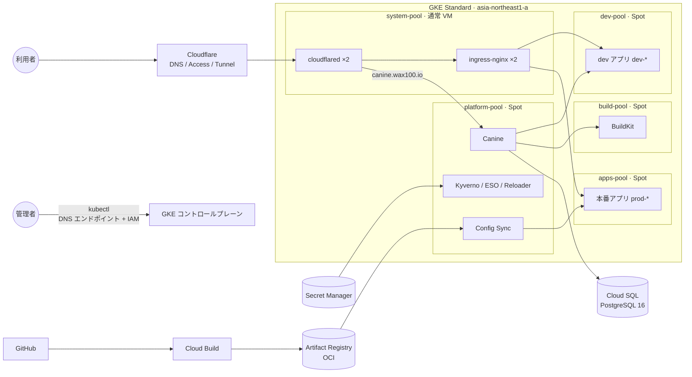

# wax100 k8s-platform

GKE の上で、**開発は [Canine](https://github.com/CanineHQ/canine)（Heroku 風の PaaS）、本番は GitOps** という分担で動かすためのリポジトリです。インフラは Terraform、クラスタの中身は Config Sync が管理します。

- 開発者は Canine の画面からアプリを作り、dev 環境で動かす
- 本番に出すときは Namespace にラベルを 1 回付けるだけ。昇格ジョブがマニフェストを整えて Pull Request を立てる
- マージすると Config Sync が本番へ同期する。本番の変更はすべて PR を通る

外部公開は Cloudflare Tunnel だけで、外部 IP もロードバランサも持ちません。管理者の `kubectl` は GKE の DNS エンドポイントに IAM で入ります（踏み台・VPN なし）。

> 状態: 構築前（ブランチ `feat/canine-paas`）。構築手順は [docs/GKE_SETUP_GUIDE.md](docs/GKE_SETUP_GUIDE.md)。

## 全体像



| 領域         | 使っているもの                                                                                                                                                                                                                                        |
| :----------- | :---------------------------------------------------------------------------------------------------------------------------------------------------------------------------------------------------------------------------------------------------- |
| クラスタ     | GKE Standard（ゾーン、STABLE チャンネル、Dataplane V2、Workload Identity）                                                                                                                                                                            |
| GitOps       | Config Sync（OCI モード）← Cloud Build が `kustomize build` した結果を Artifact Registry へ push                                                                                                                                                      |
| PaaS         | Canine（公式 Helm チャート）。Canine 本体の DB は Cloud SQL for PostgreSQL 16 `wax100-db`（private IP）。アプリの DB はクラスタ内（公式 postgres / mysql / mariadb。Bitnami の同種も取る）。DB のダンプと本番の PVC のファイルを毎日 restic で GCS へ |
| ポリシー     | Kyverno（Pod の配置先の固定、ホスト到達の拒否、イメージ取得先の書き換え、Canine と Git の境界）                                                                                                                                                       |
| 機密         | Secret Manager → External Secrets Operator → Kubernetes Secret（更新は Reloader が再起動で反映）                                                                                                                                                      |
| 公開         | Cloudflare Tunnel → ingress-nginx（ClusterIP）。`*.wax100.io` を 1 ルールで受ける                                                                                                                                                                     |
| イメージ取得 | Artifact Registry のリモートキャッシュ（Docker Hub / ghcr / quay / registry.k8s.io）                                                                                                                                                                  |
| 監視         | GKE 標準のシステムログ・メトリクスのみ                                                                                                                                                                                                                |

固定しているバージョンの一覧は [docs/ARCHITECTURE.md](docs/ARCHITECTURE.md) の「2.1」にあります。

## ノードプールとスケール

| プール          | VM                 | 台数 | 載るもの                                    | 方針                                                  |
| :-------------- | :----------------- | :--- | :------------------------------------------ | :---------------------------------------------------- |
| `system-pool`   | 通常 e2-medium     | 2〜3 | kube-system、cloudflared、ingress-nginx     | 止まってはいけないもの。入口の 2 本は別ノードに分ける |
| `platform-pool` | Spot e2-standard-2 | 1〜3 | Canine、Config Sync、Kyverno、ESO、Reloader | 止まっても数分で戻れば済むもの                        |
| `apps-pool`     | Spot e2-medium     | 0〜3 | 本番のアプリ（`prod-*`）                    | アプリが無ければ 0 台                                 |
| `dev-pool`      | Spot e2-medium     | 0〜2 | dev のアプリ（`dev-*`。Canine が動かす）    | 本番と同じノードに置かない。アプリが無ければ 0 台     |
| `build-pool`    | Spot e2-standard-2 | 0〜1 | Canine のビルダー（privileged）             | 本番アプリと同じノードに置かない                      |

配置は Kyverno が Pod の作成時に決めます（本番のアプリは apps-pool、dev のアプリは dev-pool、ビルダーは build-pool、Config Sync は platform-pool）。
dev と本番は Namespace（`dev-<app>` / `prod-<app>`）・ノード・通信・kubectl のコンテキスト（`wax100-dev` / `wax100-prod`）で分けています。

| 何が                   | 何で増減するか                                                                    |
| :--------------------- | :-------------------------------------------------------------------------------- |
| ノード（5 プール）     | Pod の **requests**（Cluster Autoscaler）。実使用量ではない                       |
| 本番アプリの Pod       | **CPU 使用率**（HPA。最小 2 / 最大 5 / 70%。昇格時に生成）                        |
| dev アプリの Pod       | 固定（Canine で設定した `replicas`）                                              |
| プラットフォームの Pod | 固定。requests は VPA の推奨値（推奨のみ・自動では書き換えない）を見て Git で直す |

requests も limits も無いアプリのコンテナには、Kyverno が既定の requests（100m / 128Mi）を入れます。requests が 0 だとノードも HPA も動かないためです。

## アプリの流れ（dev → 本番）

```powershell
# 1. Canine の画面でアプリを作り、dev で動かす

# 1. の Namespace は dev-<app> にする（Canine の作成画面で指定）

# 2. 本番に出す（初回だけ）。本番は prod-<app>・https://<app>.wax100.io
kubectl label ns dev-<app> wax100.io/promote=true

# 3. 昇格ジョブ（毎時 15 分）が Pull Request を立てる。PR 本文の作業をして、マージする
#    例: Secret Manager に値を登録する
```

昇格ジョブが `components/apps/<app>/` に作るもの:

| ファイル                                   | 内容                                                                                                                                                  | 再昇格時 |
| :----------------------------------------- | :---------------------------------------------------------------------------------------------------------------------------------------------------- | :------- |
| `base/resources.yaml`                      | dev の実体（許可した kind だけ。Secret は入らない）                                                                                                   | 上書き   |
| `overlays/production/ingress.yaml`         | `https://<app>.wax100.io` で公開                                                                                                                      | 保持     |
| `overlays/production/hpa.yaml`             | Deployment ごとの HPA（`replicas` を外すパッチは overlay の kustomization に入る）。ReadWriteOnce の PVC を付けた Deployment には付けず、1 台で動かす | 保持     |
| `overlays/production/external-secret.yaml` | 参照している Secret の雛形（値は Secret Manager）                                                                                                     | 保持     |

マージ後、その Namespace（`prod-<app>`）は Canine から変更できません（Kyverno が拒否）。2 回目以降はラベル不要で、dev の変更に追従して PR が立ちます。マージは常に手動です。詳しくは [docs/DEPLOYMENT_FLOW.md](docs/DEPLOYMENT_FLOW.md)。

## セキュリティの要点

- **入口は Cloudflare だけ**。Canine の UI（実質 cluster-admin）は Cloudflare Access で許可したメールだけが開ける。Access を付けずに公開しようとすると `terraform apply` が止まる
- **クラスタ内からも Canine に直接届かない**。NetworkPolicy で、Canine への着信を cloudflared と同じ Namespace だけに絞っている
- **アプリはホストに触れない**。hostNetwork・hostPath・privileged を Kyverno が拒否する。ビルダーだけは privileged が要るので、専用プールに隔離している
- **機密は Git に入らない**。昇格ジョブは Secret を読まず、許可した kind だけを書き出す
- **ESO が読める範囲を絞っている**。Terraform 専用の Cloudflare API トークンは IAM 条件で除外し、ClusterSecretStore は `canine` / `infra` / `prod-*` からしか使えない
- **ノードは最小権限の専用 SA**。Compute Engine の既定 SA は使わない
- **アプリの DB は毎日バックアップ**。dev も本番もクラスタ内の postgres / mysql / mariadb（公式・Bitnami）を毎日ダンプし、Canine のアプリ定義と一緒に GCS に 30 日置く。バックアップの Job は GCS に書くだけで消せず、exec は Kyverno で DB のコンテナだけに限る

## ディレクトリ

```text
terraform/                   GKE・ノードプール・VPC・Cloud SQL・Secret Manager・DB バックアップのバケット・Cloudflare・Cloud Build・Config Sync
bootstrap/root-sync.yaml     Config Sync の起点。構築時に 1 回だけ kubectl apply する
clusters/platform/           Config Sync が同期する単位。Cloud Build がここをビルドして OCI にする
addons/                      Kyverno、External Secrets、Reloader
components/infrastructure/   Canine、cloudflared、ingress-nginx、昇格・バックアップのジョブ、VPA
components/apps/             本番アプリ（昇格ジョブの PR で増える）
docs/                        設計と手順
```

各コンポーネントは `base/`（上流の Helm チャートを `helmCharts:` で取り込み、足りない所だけパッチ）と `overlays/production/` に分かれます。

## 構築

手作業が要るのは、Cloud Build の GitHub 接続（ブラウザ）、Secret の値の登録、`bootstrap/root-sync.yaml` の適用、Canine の初期設定だけです。あとは Terraform と Config Sync が作ります。

```powershell
cd terraform
terraform init
terraform apply -var=cloudflare_account_id=   # 1 回目: Cloudflare を外す
# Secret Manager に cloudflare-api-token などを登録 → -var なしで 2 回目の apply
gcloud container clusters get-credentials wax100-platform `
  --location asia-northeast1-a --project wax100 --dns-endpoint
gcloud builds triggers run manifest-sync --region=asia-northeast1 --branch=main --project=wax100
kubectl apply -f ..\bootstrap\root-sync.yaml
```

省略せずに書いた手順（state の GCS 移行、Secret を改行なしで登録する方法、Config Sync の移動、スケールの確認）は [docs/GKE_SETUP_GUIDE.md](docs/GKE_SETUP_GUIDE.md) にあります。

## 変更するとき

main への push で Cloud Build がマニフェストを作り直し、Config Sync が反映します。PR では CI（GitHub Actions）が次を確かめます。

```powershell
cargo make validate    # 全コンポーネントの kustomize build と kubeconform
cargo make hydrate     # 各コンポーネントのビルド結果を _result.json に書き出す（CI が自動でコミットする）
```

ローカルでは CI と同じ kustomize 5.8.1 / helm 4.3.0 を使ってください。

## コスト

平常時（system 2 台、platform 1 台、apps 0 台、Cloud SQL `db-f1-micro`）で月 135 ドル前後の見込みです（東京リージョン、2026 年 9 月時点の試算）。ロードバランサの固定費はありません。コストを抑えるための設計と、削れていない固定費は [docs/CHEAP_GKE_ARCHITECTURE.md](docs/CHEAP_GKE_ARCHITECTURE.md) にあります。

## ドキュメント

| ファイル                                                         | 内容                                                                    |
| :--------------------------------------------------------------- | :---------------------------------------------------------------------- |
| [docs/GKE_SETUP_GUIDE.md](docs/GKE_SETUP_GUIDE.md)               | 構築手順、構築確認、運用手順、トラブルシューティング                    |
| [docs/ARCHITECTURE.md](docs/ARCHITECTURE.md)                     | 設計の全体、固定しているバージョン、ノードプール、Kyverno、セキュリティ |
| [docs/DEPLOYMENT_FLOW.md](docs/DEPLOYMENT_FLOW.md)               | dev と本番の流れ、昇格ジョブの詳細                                      |
| [docs/CANINE_SETUP.md](docs/CANINE_SETUP.md)                     | Canine の初期設定と Build Cloud                                         |
| [docs/BACKUP.md](docs/BACKUP.md)                                 | バックアップの対象・仕組み・確認・戻し方                                |
| [docs/CHEAP_GKE_ARCHITECTURE.md](docs/CHEAP_GKE_ARCHITECTURE.md) | コストを抑えるための設計                                                |
