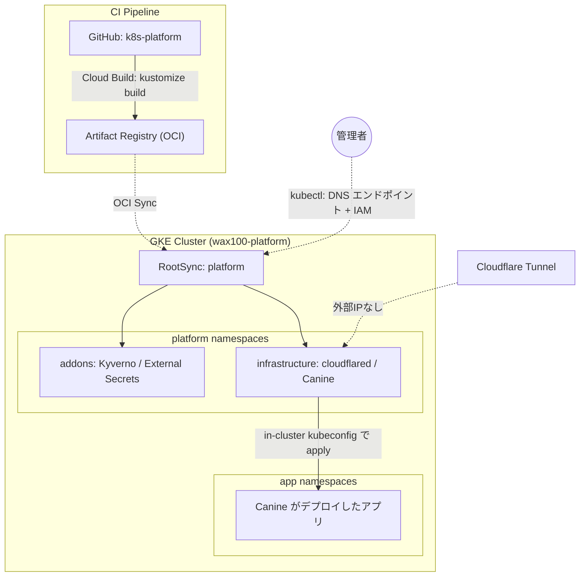

# GitOps Architecture Blueprint

このドキュメントは、本リポジトリが定義する GKE プラットフォームの全体構造と設計思想をまとめたものです。

**基本方針**: プラットフォーム基盤（アドオンとミドルウェア）は Git と Config Sync が宣言的に管理し、その上で動くアプリケーションは **Canine**（Kubernetes 向けの PaaS コントロールプレーン）が管理します。

## 1. 環境で分けた 2 つの真実の源

| 環境                 | 管理対象                                            | 真実の源 (Source of Truth)                         | 変更の入口        |
| :------------------- | :-------------------------------------------------- | :------------------------------------------------- | :---------------- |
| **プラットフォーム** | Kyverno, External Secrets, cloudflared, Canine 本体 | 本 Git リポジトリ（OCI 経由で Config Sync が同期） | Pull Request      |
| **本番アプリ**       | `components/apps/<name>/`                           | 同上                                               | 昇格 Pull Request |
| **dev / プレビュー** | Canine がデプロイする各アプリ                       | Cloud SQL `wax100-db` の DB `canine_production`    | Canine の UI      |

**本番は GitOps、開発は Canine** という分担です。Heroku 相当の操作性は開発時に享受しつつ、本番に出るものはすべて Git の差分としてレビューされます。

昇格は **初回だけ** Namespace にラベルを付けます。

```bash
kubectl label ns <app> wax100.io/promote=true
```

`canine-promote` の CronJob がその Namespace の実体を取り出し、`components/apps/<app>/{base,overlays/production}` に整形して Pull Request を立てます。マージすると Config Sync が `prod-<app>` へ同期し、**以降その Namespace は Canine からは変更できなくなります**（後述の Admission 境界）。

**2 回目以降はラベルが要りません。** 一度 `components/apps/` に載ったアプリは、ジョブが毎時 dev の状態を見に行き、差分があれば自動で追従 PR を立てます。同じアプリの PR が開いている間は新しい PR を立てないため、PR が乱立することもありません。

昇格 PR には、生成物に加えて **やるべき作業が本文に列挙されます** — 公開 URL、Secret Manager に登録が必要なシークレット ID の一覧、PVC がある場合の警告。

この分担が成立する鍵は、**同じリソースを二人の管理者が奪い合わない**ことです。Config Sync はドリフトを修正し、Canine は自分の DB を正として apply し続けるため、両者が同じ Namespace を触ると衝突が永久に続きます。Kyverno の `canine-namespace-boundary` ポリシーが、Config Sync 管理下の Namespace への Canine からの書き込みを Admission で拒否することで、これを構造的に防ぎます。

> RBAC には「この Namespace 以外で許可する」という除外の表現がありません。Canine はプロジェクトごとに Namespace を動的に作るため、許可リスト方式では新規プロジェクトの作成が壊れます。そのため権限自体は残し、Admission で境界を引いています。

なお dev 側の定義は依然として Canine の DB にしかないため、`wax100-db` のバックアップ（PITR + 7 日保持）と、`db-backup` が毎日 GCS に書き出すアプリ定義で補っています。書き出しは Config Sync 管理下（= 昇格済み）の Namespace を除外します。



## 2. 技術スタック

| コンポーネント                   | 採用技術                                           | 設計意図                                                                                                                                   |
| :------------------------------- | :------------------------------------------------- | :----------------------------------------------------------------------------------------------------------------------------------------- |
| **GitOps 同期**                  | Config Sync (OCI モード)                           | リポジトリ認証情報をクラスタに置かず、Artifact Registry から GCP ネイティブ権限で Pull する                                                |
| **マニフェスト定義**             | Kustomize (base / overlays)                        | 上流 Helm チャートを `helmCharts` で取り込み、差分だけをパッチで表現する                                                                   |
| **PaaS コントロールプレーン**    | Canine (公式 Helm チャート 0.1.10)                 | アプリのビルド・デプロイ・ログ参照を UI から行う。`BOOT_MODE=cluster` で自クラスタを管理                                                   |
| **機密情報管理**                 | External Secrets Operator + Secret Manager         | リポジトリに平文の機密を置かない。Canine の `SECRET_KEY_BASE` と `DATABASE_URL` も ESO 経由                                                |
| **ミューテーション**             | Kyverno                                            | イメージを GAR のリモートキャッシュへ書き換え（レート制限回避、ベストエフォート）、アプリとビルダーをそれぞれのプールへ振り分け            |
| **外部公開**                     | Cloudflare Tunnel + ingress-nginx                  | 外部ロードバランサを持たない。`*.<domain>` を 1 ルールで nginx に流し、アプリは Ingress を持つだけで公開される                             |
| **監視**                         | GKE 標準の `logging_config` / `monitoring_config`  | 自前の Prometheus を運用せず、SYSTEM_COMPONENTS のメトリクス・ログを Cloud Monitoring で受ける                                             |
| **データベース**                 | Cloud SQL for PostgreSQL 16 + Cloud SQL Auth Proxy | Canine の永続データ。Private IP のみ、パブリック IP なし                                                                                   |
| **Secret の再読込**              | Reloader (stakater)                                | ESO が Secret を更新したとき、それを参照する Deployment を自動で rollout restart する                                                      |
| **アクセス制御**                 | Cloudflare Access (Terraform で宣言)               | Canine UI を許可メールアドレスに限定。実質 cluster-admin の UI を素で公開しないため                                                        |
| **コントロールプレーンへの到達** | DNS ベースエンドポイント + IAM                     | 外部 IP エンドポイントは無効。踏み台も VPN も持たず、認可は `container.clusters.connect`。クラスタの状態に依存しないため締め出しが起きない |

### 2.1 固定しているバージョン

上げるときはここを見てください。`_result.json` の差分にレンダリング結果が現れます。

| 対象                      | バージョン                                 | 置き場所                                                             |
| :------------------------ | :----------------------------------------- | :------------------------------------------------------------------- |
| Canine チャート           | 0.1.10                                     | `components/infrastructure/canine/base`                              |
| Canine イメージ           | `latest` + digest 固定                     | 同上（更新: `crane digest ghcr.io/caninehq/canine:latest`）          |
| Cloud SQL Auth Proxy      | 2.25.4                                     | `canine/base/{web,worker}-patch.yaml`                                |
| cloudflared               | 2026.9.1                                   | `components/infrastructure/cloudflared/base/cloudflared.yaml`        |
| Cloud SQL (PostgreSQL)    | 16                                         | `terraform/database.tf`（Canine 本家が検証している版に合わせている） |
| ingress-nginx チャート    | 4.15.1                                     | `components/infrastructure/nginx-ingress/base`                       |
| Kyverno チャート          | 3.9.1                                      | `addons/kyverno/base`                                                |
| External Secrets チャート | 2.10.0                                     | `addons/external-secrets/base`                                       |
| Reloader チャート         | 2.2.17                                     | `addons/reloader/base`                                               |
| Headlamp チャート         | 0.45.0                                     | `addons/headlamp/base`                                               |
| kustomize / helm          | 5.8.1 / 4.3.0                              | `cloudbuild.yaml`（GitHub Actions の kustomize も 5.8.1 に固定）     |
| kubeconform / yq          | 0.8.0 / 4.53.6                             | `.github/workflows/ci.yml` / `hydrate.yml`                           |
| Terraform プロバイダ      | google 8.x / cloudflare 5.x / random 3.9.x | `terraform/providers.tf`                                             |

**External Secrets は 2.x で API が `external-secrets.io/v1` になりました。** `v1beta1` は
CRD に残っていますが `served: false` です。昇格ジョブが生成する ExternalSecret も
`v1` を出力します。

**kustomize は 5.8.0 から、helm が生成したリソースに `namespace:` トランスフォーマが
効かなくなりました。** チャート側が `metadata.namespace` を書かない場合（Canine が該当）、
namespace の無いマニフェストが出ます。`canine/base` では namespace を明示するパッチを
当てて、どちらのバージョンでも同じ結果になるようにしています。

## 3. リポジトリ構造

```text
addons/                      クラスタ全体に効くシステムコンポーネント
├── external-secrets/        base + cluster-resources (ClusterSecretStore)
├── kyverno/                 base (レジストリ書き換え / アプリとビルダーの振り分け / 境界 / ホスト隔離の ClusterPolicy)
├── reloader/                base (Secret 更新時の自動 rollout restart)
└── headlamp/                base (クラスタ閲覧用ダッシュボード。dashboard.wax100.io、Access 保護)

components/apps/             本番アプリ (昇格 PR が追記する)
└── kustomization.yaml       昇格済みアプリの一覧

components/infrastructure/   プラットフォーム・ミドルウェア
├── canine/                  base + overlays/production
├── canine-promote/          dev から本番へ昇格 PR を立てる CronJob
├── cloudflared/             base (system-pool / 2 本 / PDB)
├── namespaces/              複数コンポーネントが相乗りする Namespace (infra)
└── nginx-ingress/           base (ClusterIP。cloudflared からの唯一の入口 / system-pool / 2 本)

clusters/platform/           Config Sync が同期する単位。Cloud Build が OCI 化する
bootstrap/                   人が 1 回だけ kubectl apply するもの (RootSync)
terraform/                   GKE / ノードプール / VPC / Cloud SQL / Secret Manager / Cloudflare / Config Sync
docs/                        本ドキュメント群
```

各コンポーネントは `base/`（環境非依存）と `overlays/<env>/`（環境差分）に分かれます。単一クラスタ構成のため現在の overlay は `production` のみです。

## 4. ノードプール設計

| プール          | 種別        | マシン                                  | スケール | taint                                                    | 用途                                                                    |
| :-------------- | :---------- | :-------------------------------------- | :------- | :------------------------------------------------------- | :---------------------------------------------------------------------- |
| `system-pool`   | **通常 VM** | e2-medium（`system_pool_machine_type`） | 2〜3     | なし                                                     | kube-system、**cloudflared ×2、ingress-nginx ×2**                       |
| `platform-pool` | Spot        | e2-standard-2                           | 1〜3     | `gke-spot:NoSchedule`                                    | Canine, **Config Sync**, Kyverno, ESO, Reloader, 昇格・スナップショット |
| `apps-pool`     | Spot        | e2-medium（可変）                       | 0〜3     | `gke-spot:NoSchedule`                                    | Canine がデプロイするアプリ                                             |
| `build-pool`    | Spot        | e2-standard-2（可変）                   | 0〜1     | `gke-spot:NoSchedule` + `workload-type=build:NoSchedule` | Canine のビルダー（BuildKit、privileged）                               |

### プールの役割分け

- **system** — ネットワークを動かすのに最低限必要で、**停止を許容できない**もの。外からの唯一の入口である cloudflared と ingress-nginx もここに置く。Spot に置くと回収 1 回でアプリも Canine UI も外から見えなくなるため。どちらも 2 本を別ノードに分け（必須の anti-affinity）、PDB `minAvailable: 1` でノード更新時に同時に落ちないようにしている。ingress-nginx にはリソース上限を付け、インターネットからの負荷が同じノードの kube-dns を圧迫しないようにしている
- **platform** — メトリクスや GitOps、Canine など、止まっても数分で戻れば済むもの。**Config Sync もここ**。GKE が入れる Config Sync の Pod は nodeSelector も toleration も持たず、そのままだと taint の無い system-pool に載るため、Kyverno（`pin-config-sync-to-platform-pool`、`failurePolicy: Ignore`）が Pod の作成時に platform-pool 行きを注入する。Kyverno が居ない間（クラスタ作成直後など）は注入されず system-pool に載るので、Config Sync が Kyverno に依存して起動できなくなることはない。Google の公式手順は同じことを MutatingAdmissionPolicy（Kubernetes 1.36 以上）で行うもので、STABLE チャンネルに 1.36 が来たら置き換える
- **入口の優先度** — cloudflared と ingress-nginx には PriorityClass `platform-ingress`（1000000）を付けている。既定の 0 のままだと、system-pool のメモリが足りなくなったとき真っ先に追い出される。GKE の system-cluster-critical（2000000000）よりは下にして、kube-dns 等は押しのけない
- **apps** — Canine が動かすアプリ
- **build** — Canine のビルダー。privileged で動く（= ノードの root と等価）ため、本番アプリと同じノードに置かない

**Kyverno が止まっても入口は止まらない。** イメージ書き換えのポリシー（`artifact-registry-mirror`）はほぼ全 Pod にかかるが、`failurePolicy: Ignore` にしてある。書き換えはレート制限を避けるための最適化で、セキュリティ上の統制ではないため。Kyverno が落ちている間は上流から直接取得する。`Fail` のポリシー（apps への固定、ホスト到達の拒否、build への固定、Canine の境界）には `webhookConfiguration.matchConditions` を付けている。Kyverno の Webhook は既定で `kube-system` と `kyverno` 以外の**全 Namespace** で呼ばれ、ポリシーの `exclude` は Kyverno の中でしか効かないため、これが無いと Kyverno が落ちている間は `infra`（入口）や Config Sync の Pod まで作れなくなる。`matchConditions` があると Kyverno はポリシー専用の Webhook を作り、条件は API サーバーが評価するので、Kyverno が落ちていても対象外の Namespace は素通しになる（Kyverno v1.19 のソースで確認）。結果として、Kyverno の停止で影響を受けるのはアプリ（と build）の Pod の新規作成と、Canine からの操作だけになる。Kyverno の admission controller は 2 本 + PDB にして、ローリング更新時の瞬断も防いでいる。

**プラットフォーム用のプールを 1 つにしている理由。** 以前は `xs`/`sm`/`md`/`lg` の
4 ティアに分け、Pod 側の nodeAffinity で振り分けていました。これをやめています。

Cluster Autoscaler は **「A プールを空けるために B プールを増やす」ことをしません**。
縮退の判定は「**今あるノード**に載せ替えられるか」だけで行われます。最小 0 台の
プールが複数並んでいると、いったん各プールに散った Pod を寄せ直す経路が存在せず、
Spot の回収でプールが入れ替わるたびにノードが増える一方になります。結果として
**全プールが上限に張り付いたまま戻らない**状態に陥ります。

プールを 1 つにすれば同一プール内で自由に載せ替えられるため、素直に縮退します。
常駐 Pod の要求合計は概ね cpu 750m / memory 1.7Gi で、e2-standard-2
(cpu 2 / memory 8Gi) なら通常時 1 台に収まります。Pod 側は
`nodeSelector: workload-type=platform` と Spot の toleration だけを持ち、
ティアを指定する nodeAffinity は持ちません。

Canine が生成する Pod は nodeSelector も toleration も持ちません。そのままでは taint のない `system-pool` に載ってしまい、GKE のシステムコンポーネントとアプリが同居します。逆に `apps-pool` を Spot の taint で保護すると、今度はアプリがどこにも載らなくなります。

そこで **Kyverno の ClusterPolicy `pin-apps-to-apps-pool`** が、アプリ用 Namespace の Pod に Admission 時点で次を注入します。

- `nodeSelector: workload-type=app`（**上書き**。アプリ側の指定は尊重しない。尊重すると、アプリが `workload-type: system` と書くだけで taint の無い system-pool に載れてしまうため）
- `cloud.google.com/gke-spot` の toleration

結果として、アプリは **Spot の `apps-pool` にのみ載り、`system-pool` と `platform-pool` からは締め出されます**。除外対象は GKE のシステム Namespace（`kube-system`, `gke-managed-*`, `gmp-*` など）、Config Sync の Namespace、本リポジトリが管理する `canine` / `infra` / `external-secrets` / `kyverno` / `reloader` / `headlamp`、そして build-pool へ送る `canine-k8s-builder` です。

ビルダーは別のポリシー **`pin-builders-to-build-pool`** が扱います。同じく nodeSelector を**上書き**し、toleration を 2 つ注入します。ビルダーが build-pool 以外に載ることは許しません。

**Node Auto-Provisioning は無効化**しています（`cluster_autoscaling.enabled = false`）。有効のままだと、既存プールに収まらない Pod のために GKE が Spot ではない独自のノードプールを作りうるためです。

## 5. アプリの公開経路

```text
インターネット → Cloudflare (Access / WAF) → Tunnel → cloudflared Pod
   → ingress-nginx (ClusterIP) → Ingress のホスト一致 → アプリの Service
```

Cloudflare 側は**トンネル本体からルーティング・DNS まで Terraform が宣言**します
（`cloudflare-tunnel.tf`）。ダッシュボードでの手作業はありません。
ルーティングの実体は 3 ルールだけです。

| hostname           | 転送先        |
| :----------------- | :------------ |
| `canine.wax100.io` | Canine UI     |
| `*.wax100.io`      | ingress-nginx |
| （その他）         | 404           |

DNS もワイルドカード CNAME 1 件を Terraform が作ります。したがって**アプリを 1 つ増やすときに Cloudflare 側でやることは何もありません** — `Ingress` リソースが Git に入るだけで `https://<app>.wax100.io` が生えます。昇格ジョブはこの Ingress も自動生成します。

ロードバランサは作らないため、この経路に固定費は発生しません。ingress-nginx は ClusterIP で、外部 IP も持ちません。

## 6. コンテナレジストリ・キャッシュ戦略 (Kyverno)

Docker Hub 等のレート制限を回避し、イメージ取得を高速化するため、イメージの取得を Google Artifact Registry のリモートリポジトリ・キャッシュ（`asia-northeast1`）へ向けます。これは**ベストエフォート**です（`failurePolicy: Ignore`）。Kyverno が止まっている間は書き換えずに上流から直接取得し、Pod の作成は止めません。

`kustomization.yaml` ごとに `images` トランスフォーマーを書くのではなく、**Kyverno の ClusterPolicy**（`addons/kyverno/base/clusterpolicy-registry-mirror.yaml`）で Pod 作成時に書き換えます。

- `docker.io/` → `asia-northeast1-docker.pkg.dev/<PROJECT_ID>/docker-hub-cache/`
- `ghcr.io/` → `.../ghcr-cache/`（Canine のイメージもここを通ります）
- `quay.io/` → `.../quay-cache/`
- `registry.k8s.io/` → `.../k8s-cache/`
- `nginx:1.27`（レジストリもユーザー名も無い公式イメージ）→ `.../docker-hub-cache/library/nginx:1.27`
- `bitnami/redis:7`（レジストリ省略）→ `.../docker-hub-cache/bitnami/redis:7`

最後の 2 つが重要です。Canine がデプロイするアプリや一般的な Helm チャートはレジストリを省略した書き方が大半で、接頭辞付きの参照しか書き換えないとレート制限回避という目的が最も必要な場面で効きません。先頭セグメントに `.` や `:` を含む参照（`registry.example.com/foo`、`localhost:5000/foo`）は対象外です。

各ルールは `containers` と `initContainers` の両方を走査します。foreach の対象は `request.object.spec.initContainers || []` のように**空配列で補って**います。補わないと `initContainers` を持たない Pod（= ほぼ全部）で評価エラーになり、書き換えが 1 件も行われません（`failurePolicy: Fail` だった頃は、この評価エラーで Pod の作成そのものが拒否されていました）。Kyverno CLI で実際の Pod に適用して、書き換わることを確認しています。

`gcr.io` はキャッシュしません（Google のレジストリで、レート制限の問題が無いため）。Cloud SQL Auth Proxy はここから直接取得します。

**Kyverno 自身は書き換えの対象外です**: Kyverno は既定の `resourceFilters` で自分の Namespace（`kyverno`）と `kube-system` などを除外しているため、Kyverno 自身の Pod はこのポリシーを通りません。Kyverno のイメージは上流（`reg.kyverno.io` / `ghcr.io`）から直接取得されます。

**注意**: この書き換えは Canine がデプロイするアプリの Pod にも適用されます。ユーザー自身のプライベートレジストリを使う場合は、そのレジストリが書き換え対象に含まれないことを確認してください。

## 7. セキュリティ上の論点

- **Canine の境界**: 公式チャートの ClusterRole は `apiGroups/resources/verbs` すべてに `*` を許可します（実質 cluster-admin）。Config Sync 管理下の Namespace だけは Kyverno の Admission で書き込みを拒否していますが、**それ以外のクラスタ操作は依然として可能**です。任意の Namespace にリソースを作る PaaS の性質上避けられないため、**UI へのアクセス制御が唯一の防壁**です。Cloudflare Access のアプリケーションとポリシーは `terraform/cloudflare-access.tf` で宣言しており、`canine_admin_emails` に列挙したアドレスだけが到達できます（ダッシュボードでの手作業に依存しません）。
- **Canine の UI にクラスタ内から直接届かせない**: Cloudflare Access は外からの経路しか守りません。`canine` Namespace に NetworkPolicy（`components/infrastructure/canine/base/networkpolicy.yaml`）を置き、Canine の Pod への着信を同じ Namespace と `infra` の cloudflared からだけに絞っています。apps-pool のアプリから `canine.canine.svc:3000` へは届きません。NetworkPolicy を実際に効かせるため、クラスタは Dataplane V2（`datapath_provider = "ADVANCED_DATAPATH"`）で作ります（作成後は変更不可。各ノードに anetd の DaemonSet が載ります）
- **ESO が読める Secret を絞る**: ESO はプロジェクト全体の `secretAccessor` を持ちますが、IAM 条件で `cloudflare-api-token` だけは除外しています（Terraform 専用で、クラスタ内では使わない。読めると Access の保護を外せる）。ClusterSecretStore `gcp-secret-store` も `conditions` で `canine`・`infra`・`prod-*` の Namespace からしか使えないようにしています
- **アプリ Pod からホストへの到達を禁止**: `apps-pool` には Canine 経由で利用者が投入した任意のコンテナが載ります。Kyverno の `restrict-app-host-access` が hostNetwork / hostPID / hostIPC / hostPath / 特権コンテナを拒否します。ノードも既定の Compute Engine SA ではなく、ログ・メトリクス・イメージ取得だけを持つ専用 SA (`gke-node`) で動かしています。両方が揃って初めて「メタデータサーバ経由でノードの権限を奪う」経路が塞がります。
- **ビルダーは隔離して許可する**: Canine の Build Cloud は `docker buildx --driver kubernetes` で BuildKit を立て、rootless を指定しないため **privileged** で動きます（docker/buildx の `manifest.go` で `privileged := true`）。privileged はノードの root と等価で、hostPath を禁止してもディスクを直接マウントできるため、ポリシーで絞っても意味がありません。代わりに**専用の `build-pool` に隔離**しています。破られても同じノードに本番アプリの Secret は無く、ノード SA `gke-build-node` は Artifact Registry を**リモートキャッシュのリポジトリだけ**読めるので、アプリのイメージ（= ソースコード）や Config Sync のマニフェストにも届きません。
  - なお Dockerfile の `RUN` は privileged では動きません。buildkitd に `security.insecure` の許可が無いため、非特権の入れ子コンテナで実行されます。ビルド中の悪意ある依存がノードに出るには、さらにコンテナ脱出が要ります。
  - ビルダーは**常駐の Deployment** です。Build Cloud を入れている間は build-pool が 0 台にならず、Spot 1 台が常時動きます。
- **kubeconfig を保存しない**: `BOOT_MODE=cluster` では ServiceAccount トークンから in-cluster kubeconfig を組み立てるため、クラスタ認証情報がデータベースに保存されません。
- **Private クラスタ + Cloudflare Tunnel**: 外部 IP を持たず、インバウンドは Cloudflare からのトンネル経由のみです。
- **コントロールプレーンの IP エンドポイントは内部のみ**: `private_control_plane_only = true` で外部 IP エンドポイントを無効化しています。`master_authorized_cidrs` の既定は空で、IP 経由で外から触ることはできません。
- **管理者の `kubectl` は DNS ベースエンドポイント + IAM**: 認可はネットワークではなく IAM（`container.clusters.connect`）で行います。**この口はクラスタの中身に依存しない**ため、cloudflared が落ちていてもノードが 0 台でも到達でき、踏み台・VPN・WARP をどれも必要としません。CI からも同じ経路をサービスアカウントで使えます。
  - 代償として、守りは IAM 1 枚になります。Google アカウントの 2 段階認証の強制と、`container.clusters.connect` を持つプリンシパルを絞ることが実質的な防御線です。境界が必要なら VPC Service Controls を被せ、`enable_dns_endpoint_external = false` にして VPC 内部からのみ到達させます。
