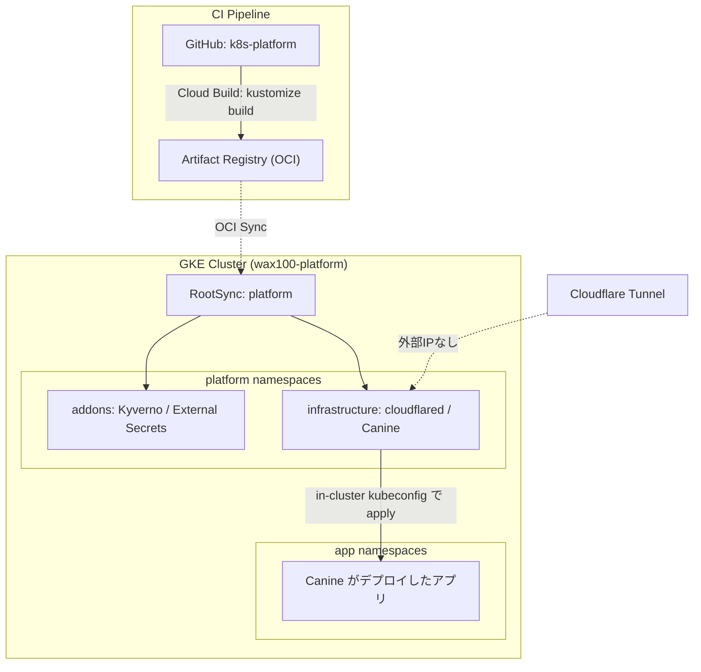

# GitOps Architecture Blueprint

このドキュメントは、本リポジトリが定義する GKE プラットフォームの全体構造と設計思想をまとめたものです。

**基本方針**: プラットフォーム基盤（アドオンとミドルウェア）は Git と Config Sync が宣言的に管理し、その上で動くアプリケーションは **Canine**（Kubernetes 向けの PaaS コントロールプレーン）が管理します。

## 1. 2層のコントロールプレーン

| 層 | 管理対象 | 真実の源 (Source of Truth) | 復旧方法 |
| :--- | :--- | :--- | :--- |
| **プラットフォーム層** | Kyverno, External Secrets, cloudflared, Canine 本体 | 本 Git リポジトリ（OCI 経由で Config Sync が同期） | `terraform apply` + Git から再同期 |
| **アプリケーション層** | Canine がデプロイする各アプリ | Canine の PostgreSQL (Cloud SQL `canine-db`) | Cloud SQL のバックアップからリストア |

アプリの定義が Git に載らないことは意図的なトレードオフです。Heroku 相当の操作性と引き換えに、アプリ層の構成管理は Canine のデータベースに委ねられます。**したがって `canine-db` のバックアップはプラットフォームの生命線**であり、Terraform 側で PITR と 7 日間の保持を有効にしています。



## 2. 技術スタック

| コンポーネント | 採用技術 | 設計意図 |
| :--- | :--- | :--- |
| **GitOps 同期** | Config Sync (OCI モード) | リポジトリ認証情報をクラスタに置かず、Artifact Registry から GCP ネイティブ権限で Pull する |
| **マニフェスト定義** | Kustomize (base / overlays) | 上流 Helm チャートを `helmCharts` で取り込み、差分だけをパッチで表現する |
| **PaaS コントロールプレーン** | Canine (公式 Helm チャート 0.1.10) | アプリのビルド・デプロイ・ログ参照を UI から行う。`BOOT_MODE=cluster` で自クラスタを管理 |
| **機密情報管理** | External Secrets Operator + Secret Manager | リポジトリに平文の機密を置かない。Canine の `SECRET_KEY_BASE` と `DATABASE_URL` も ESO 経由 |
| **ミューテーション** | Kyverno | コンテナイメージを GAR のリモートキャッシュへ強制ルーティング（レート制限回避） |
| **外部公開** | Cloudflare Tunnel (`cloudflared`) | 外部ロードバランサを持たない。転送ルールの固定費（$0.025/時 ≒ 月 $18）が発生しない |
| **監視** | GKE 標準の `logging_config` / `monitoring_config` | 自前の Prometheus を運用せず、SYSTEM_COMPONENTS のメトリクス・ログを Cloud Monitoring で受ける |
| **データベース** | Cloud SQL for PostgreSQL 16 + Cloud SQL Auth Proxy | Canine の永続データ。Private IP のみ、パブリック IP なし |

## 3. リポジトリ構造

```
addons/                      クラスタ全体に効くシステムコンポーネント
├── external-secrets/        base + cluster-resources (ClusterSecretStore)
└── kyverno/                 base (レジストリ書き換え ClusterPolicy を含む)

components/infrastructure/   プラットフォーム・ミドルウェア
├── canine/                  base + overlays/production
└── cloudflared/             base

clusters/platform/           Config Sync が同期する単位。Cloud Build が OCI 化する
terraform/                   GKE / VPC / Cloud SQL / Secret Manager / Config Sync 有効化
docs/                        本ドキュメント群
```

各コンポーネントは `base/`（環境非依存）と `overlays/<env>/`（環境差分）に分かれます。単一クラスタ構成のため現在の overlay は `production` のみです。

## 4. ノードプール設計

| プール | 種別 | マシン | スケール | taint | 用途 |
| :--- | :--- | :--- | :--- | :--- | :--- |
| `system-pool` | 通常 VM | e2-medium | 2〜3 | なし | kube-system 等の GKE システムコンポーネント |
| `platform-{xs,sm,md,lg}` | Spot | e2-small 〜 e2-standard-4 | 各 0〜3 | `cloud.google.com/gke-spot=true:NoSchedule` | Canine, cloudflared, Kyverno, ESO |
| `apps-pool` | Spot | e2-medium（可変） | 0〜3 | `cloud.google.com/gke-spot=true:NoSchedule` | Canine がデプロイするアプリ |

Canine が生成する Pod は nodeSelector も toleration も持ちません。そのままでは taint のない `system-pool` に載ってしまい、GKE のシステムコンポーネントとアプリが同居します。逆に `apps-pool` を Spot の taint で保護すると、今度はアプリがどこにも載らなくなります。

そこで **Kyverno の ClusterPolicy `pin-apps-to-apps-pool`** が、アプリ用 Namespace の Pod に Admission 時点で次を注入します。

- `nodeSelector: workload-type=app`（`+()` アンカー付き。アプリが明示していれば尊重する）
- `cloud.google.com/gke-spot` の toleration

結果として、アプリは **Spot の `apps-pool` にのみ載り、`system-pool` と `platform-*` からは締め出されます**。除外対象は GKE のシステム Namespace（`kube-system`, `gke-managed-*`, `gmp-*` など）、Config Sync の Namespace、本リポジトリが管理する `canine` / `infra` / `external-secrets` / `kyverno` です。

**Node Auto-Provisioning は無効化**しています（`cluster_autoscaling.enabled = false`）。有効のままだと、既存プールに収まらない Pod のために GKE が Spot ではない独自のノードプールを作りうるためです。

## 5. コンテナレジストリ・キャッシュ戦略 (Kyverno)

Docker Hub 等のレート制限を回避し、イメージ取得を高速化するため、すべてのイメージトラフィックを Google Artifact Registry のリモートリポジトリ・キャッシュ（`asia-northeast1`）へ強制ルーティングします。

`kustomization.yaml` ごとに `images` トランスフォーマーを書くのではなく、**Kyverno の ClusterPolicy**（`addons/kyverno/base/clusterpolicy-registry-mirror.yaml`）で Pod 作成時に書き換えます。

- `docker.io/` → `asia-northeast1-docker.pkg.dev/<PROJECT_ID>/docker-hub-cache/`
- `ghcr.io/` → `.../ghcr-cache/`（Canine のイメージもここを通ります）
- `quay.io/` → `.../quay-cache/`
- `registry.k8s.io/` → `.../k8s-cache/`
- `nginx:1.27`（レジストリもユーザー名も無い公式イメージ）→ `.../docker-hub-cache/library/nginx:1.27`
- `bitnami/redis:7`（レジストリ省略）→ `.../docker-hub-cache/bitnami/redis:7`

最後の 2 つが重要です。Canine がデプロイするアプリや一般的な Helm チャートはレジストリを省略した書き方が大半で、接頭辞付きの参照しか書き換えないとレート制限回避という目的が最も必要な場面で効きません。先頭セグメントに `.` や `:` を含む参照（`registry.example.com/foo`、`localhost:5000/foo`）は対象外です。

各ルールは `containers` と `initContainers` の両方を走査します。

**ブートストラップの例外**: Kyverno 自身の Pod は自分の Webhook でインターセプトできないため、Kyverno のイメージのみ Kustomize の `images` 機能で静的に書き換えています。

**注意**: この書き換えは Canine がデプロイするアプリの Pod にも適用されます。ユーザー自身のプライベートレジストリを使う場合は、そのレジストリが書き換え対象に含まれないことを確認してください。

## 6. セキュリティ上の論点

- **Canine の権限**: 公式チャートの ClusterRole は `apiGroups/resources/verbs` すべてに `*` を許可します（実質 cluster-admin）。任意の Namespace にリソースを作る PaaS の性質上避けられないため、**UI へのアクセス制御が唯一の防壁**です。Cloudflare Access（Zero Trust）で `canine.wax100.io` に認証を掛けてください。
- **kubeconfig を保存しない**: `BOOT_MODE=cluster` では ServiceAccount トークンから in-cluster kubeconfig を組み立てるため、クラスタ認証情報がデータベースに保存されません。
- **Private クラスタ + Cloudflare Tunnel**: 外部 IP を持たず、インバウンドは Cloudflare からのトンネル経由のみです。
- **コントロールプレーンは内部エンドポイントのみ**: `private_control_plane_only = true` で外部エンドポイントを無効化しています。`master_authorized_cidrs` の既定は空で、公開経路からの許可はゼロです。管理者の `kubectl` は **Cloudflare WARP → cloudflared の Private Network ルート → 内部エンドポイント** で到達します。GKE のノード・Pod・Service の IP レンジは認可ネットワークの設定に関わらず常に内部エンドポイントへ到達できるため、クラスタ内で動く cloudflared が踏み台の役割を果たします。締め出された場合の復旧は `docs/GKE_SETUP_GUIDE.md` の「緊急時の復旧」を参照してください。
