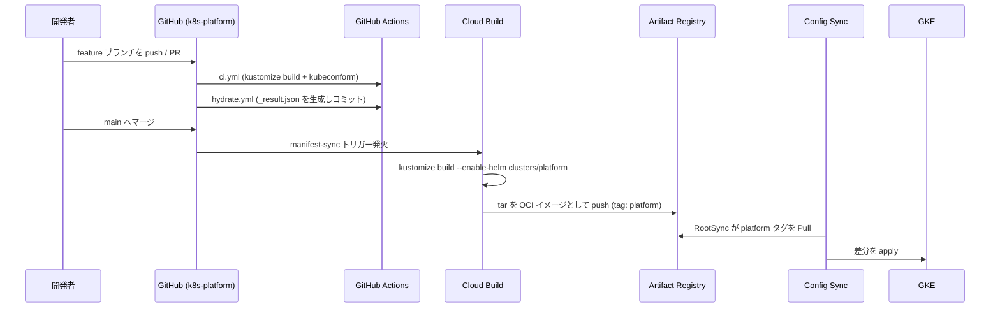
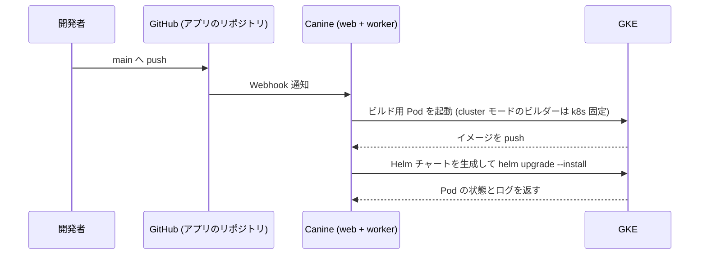
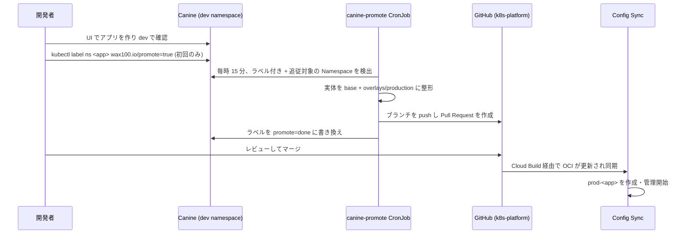

# デプロイメント＆リリースフロー

本プラットフォームは **本番を GitOps、開発を Canine** で分担します。どの経路を通るかは「何を、どの環境に変更するか」で決まります。

| 変更対象 | 経路 | 所要時間の目安 |
| :--- | :--- | :--- |
| プラットフォーム基盤（アドオン / ミドルウェア / Canine 自身） | Git → Cloud Build → Artifact Registry (OCI) → Config Sync | 数分 |
| **本番アプリ** | `components/apps/` への PR → Cloud Build → Config Sync | 数分 |
| dev / プレビューのアプリ | アプリの Git リポジトリ → Canine（ビルド → デプロイ） | 数分 |
| dev → 本番の初回昇格 | Namespace にラベル → 昇格 PR → レビュー → マージ | 最大 1 時間 + レビュー |
| 昇格済みアプリの追従 | dev を更新するだけ → 自動で追従 PR → レビュー → マージ | 最大 1 時間 + レビュー |

## 1. プラットフォーム変更のフロー



### 1.1 ローカルでの事前検証

```powershell
cargo make validate    # kustomize build + kubeconform
cargo make hydrate     # _result.json を再生成
cargo make pre-commit  # 上記2つをまとめて実行
```

`_result.json` は「Config Sync が最終的にクラスタへ送る API オブジェクト」のスナップショットです。PR の差分として現れるため、Helm チャートのバージョンを上げたときに**実際に何が変わるのか**をレビューできます。

### 1.2 CI で走るもの

| ワークフロー | 内容 |
| :--- | :--- |
| `ci.yml` | 全 `kustomization.yaml` を `kustomize build` し、`kubeconform -strict` でスキーマ検証 |
| `hydrate.yml` | `_result.json` を再生成し、差分があれば PR ブランチへコミット |
| `format-and-lint.yml` | Prettier と Super-Linter による整形・構文チェック |
| `secret-scanning.yml` | TruffleHog / gitleaks による機密情報スキャン |

### 1.3 Config Sync の適用

`bootstrap/root-sync.yaml`（ブートストラップ時に手で 1 回適用する）が OCI イメージの `platform` タグを監視します。Cloud Build が新しいタグを push すると、RootSync が自動的に差分を取り込みます。

デプロイ順序は `config.kubernetes.io/depends-on` アノテーションで制御しています。

1. **Kyverno**（`addons/kyverno`）— 後続 Pod のイメージ書き換えを確実に行うため最優先
2. **External Secrets**（`addons/external-secrets`）— Kyverno の Admission Controller に依存
3. **Canine**（`components/infrastructure/canine`）— External Secrets が Secret を作ってから起動

### 1.4 ロールバック

Config Sync は Git（正確には OCI タグ）の状態に追従します。`git revert` して main に戻せば、Cloud Build が再ビルドし、クラスタも元に戻ります。緊急時は Artifact Registry 上の以前の `platform-<COMMIT_SHA>` タグを `platform` に付け替えることで、Git を待たずに巻き戻せます。

## 2. dev / プレビューのフロー (Canine)

dev 環境のアプリ定義は本リポジトリには存在せず、Canine の UI（または API）で管理します。本番へ出すときは後述の昇格フローを通ります。



### 2.1 ビルドの仕組み

`BOOT_MODE=cluster` では、Canine のビルダーは `k8s` に固定されます（`BuildConfiguration::BUILDER_OPTIONS`）。Docker ソケットのマウントは不要で、ビルドはクラスタ内の Pod として実行されます。

### 2.2 公開

dev 環境のアプリは Canine の中だけで完結するため、既定では外部公開されません。dev のまま外から触りたい場合だけ、Cloudflare のトンネル設定（`terraform/cloudflare-tunnel.tf`）にホスト名を足してください。

**本番に昇格したアプリは自動で公開されます。** 昇格ジョブが `Ingress` を生成し、`*.apps.wax100.io` を ingress-nginx にまとめて流しているワイルドカードのルールが拾うため、Cloudflare 側の作業も DNS の追加も要りません。

### 2.3 ロールバック

dev 環境は Canine の UI からリビジョンを選んでロールバックします（Helm のリリース履歴に相当）。本番は `git revert` してマージすれば Config Sync が元に戻します。

## 3. 昇格フロー (dev → 本番)



### 3.1 生成されるもの

```
components/apps/<app>/
├── base/
│   ├── kustomization.yaml
│   └── resources.yaml            # dev の実体（再昇格で上書きされる）
└── overlays/production/          # すべて初回のみ生成。以降は上書きしない
    ├── kustomization.yaml        # namespace: prod-<app>
    ├── namespace.yaml
    ├── ingress.yaml              # <app>.apps.wax100.io で公開
    └── external-secret.yaml      # 参照している Secret の雛形
```

本番固有の差分（レプリカ数、リソース要求、HPA など）は **overlay 側に書いてください**。`base/resources.yaml` は再昇格のたびに上書きされます。

**Ingress は自動生成されます。** `http` という名前のポート、なければ 80、3000 の順で Service を選び、`<app>.apps.wax100.io` へのルールを作ります。Cloudflare 側の設定も DNS も不要です。

**ExternalSecret は雛形が自動生成されます。** 昇格ジョブは Secret の値を読みません（RBAC 上も読めません）。Deployment の `secretKeyRef` / `envFrom.secretRef` / ボリュームマウントから **参照名とキーだけ**を集めて雛形を組み立てます。値は Secret Manager に `prod-<app>-<secret名>-<キー名>` の ID で登録してください。**登録するまで本番の Pod は起動しません。** PR 本文に必要な ID の一覧が出ます。

### 3.1.1 2 回目以降（追従）

一度 `components/apps/` に載ったアプリは、**ラベル無しで自動的に追従されます**。ジョブが毎時 dev の状態を見に行き、差分があれば PR を立てます。同じアプリの PR が開いている間は新しい PR を立てません。

### 3.2 昇格時に落とされるもの

- `status` と、更新のたびに変わるメタデータ（`resourceVersion` / `uid` / `generation` など）
- 新しい Namespace で再採番される値（Service の `clusterIP`・`nodePort`、PVC の `volumeName`）
- 他リソースが所有しているもの（CronJob が作った Job など）と、既定の ServiceAccount
- **Secret**（昇格ジョブは RBAC 上も読めません）。アプリの機密は `ExternalSecret` として別途 PR で定義してください

### 3.3 昇格後

その Namespace は Config Sync の管理下に入り、Kyverno の `canine-namespace-boundary` が Canine からの書き込みを拒否します。本番の変更は `components/apps/` への PR で行います。dev 側を更新すれば追従 PR が自動で立ちます。

PR のマージは**常に手動**です。本番に出るものは必ず人が見る、という前提を保っています。

## 4. 経路が交差する箇所

| 事象 | 影響 |
| :--- | :--- |
| Kyverno のレジストリ書き換えポリシー | Canine がデプロイするアプリの Pod にも適用される。プライベートレジストリを使う場合は除外設定が必要 |
| `apps-pool` の上限 | `apps_pool_max_nodes` を超えるとアプリが Pending になる。Canine 側からは「起動しない」ように見える |
| Canine 本体の停止 | 稼働中のアプリは動き続ける（Canine はコントロールプレーンのみ）。dev の新規デプロイとログ参照ができなくなる。**本番は影響を受けない**（Config Sync が管理しているため） |
| `canine-db` の喪失 | **dev の定義が失われる**。本番は Git にあるため無傷 |

## 5. 認証情報

- **Cloud Build → Artifact Registry**: `cloudbuild_sa` サービスアカウント（Terraform 管理）
- **Config Sync → Artifact Registry**: `config-sync-sa` + Workload Identity。リポジトリ認証情報をクラスタに置かない
- **Canine → Cloud SQL**: `canine-sa` (KSA) → `canine-sa@<project>.iam.gserviceaccount.com` (GSA) の Workload Identity バインディング
- **Canine → GKE API**: ServiceAccount トークンから組み立てる in-cluster kubeconfig
- **Canine → GitHub**: Canine の UI から GitHub App / OAuth を接続（Canine のデータベースに保存）
- **昇格ジョブ → GitHub**: Secret Manager の `canine-promote-github-token`（k8s-platform の Contents / Pull requests: Read and write）
