# GitOps デプロイメント＆リリースフロー

本ドキュメントは、アプリケーション (`wax100-blog`) とマニフェスト (`k8s-platform`) の2つのリポジトリを連携させ、完全自動化された GitOps デプロイフローの全体像および各環境（Dev / Stag / Prod）への反映タイミングを定義したものです。

---

## 1. 全体アーキテクチャ図 (シーケンスフロー)

アプリケーションのコードプッシュを起点として、インフラ（GKEクラスター）に変更が反映されるまでの一連の流れです。

```mermaid
sequenceDiagram
    participant Dev as Developer
    participant AppRepo as GitHub (App Repo)
    participant Manifest as GitHub (Manifest Repo)
    participant CB as Cloud Build
    participant GAR as Artifact Registry
    participant GKE as GKE (Config Sync)

    %% アプリケーションデプロイフロー
    Note over Dev,AppRepo: 1. Application Deployment Flow
    Dev->>AppRepo: Push (main / release branch)
    rect rgb(30, 30, 30)
        AppRepo->>AppRepo: コンテナビルド & Push
        AppRepo->>Manifest: Kustomize イメージタグ更新を直接コミット
        Note right of AppRepo: 本番(Prod)はPR手動マージで進める
    end

    %% マニフェスト適用フロー
    Note over Manifest,GKE: 2. Infrastructure Sync Flow (GitOps)
    Manifest->>Manifest: CI検証 (kubeconform)
    Manifest->>Manifest: Hydration生成 (_result.json 自動コミット)
    
    Manifest->>CB: Cloud Build トリガー発火 (※_result.json更新時はスキップ)
    rect rgb(30, 30, 30)
        CB->>CB: 全3環境の kustomize build を個別 tar ボール化
        CB->>GAR: 環境毎に隔離した OCI イメージとして Push (tag: latest / stg / prod)
    end
    
    GKE-->>GAR: 定期監視 (約20秒間隔)
    GAR-->>GKE: OCI イメージの変更を検知し Pull
    Note over GAR,GKE: Devは Terraform が作成した標準エージェントが担当<br/>Stg/Prodは手作業で定義した YAML エージェントが担当
    GKE->>GKE: 差分を抽出しクラスターへ自動適用 (kubectl apply)
```

---

## 2. アプリケーションのデプロイフロー (App Repo -> Manifest Repo)

アプリケーションリポジトリでコードが変更されてから、各環境の Kubernetes マニフェストファイルのイメージタグが更新されるまでのプロセスです。

### 2.1. Dev (開発) 環境
- **役割**: 最新の開発コードを常に反映・テストする環境。
- **デプロイトリガー**: `wax100-blog` リポジトリの `main` ブランチへのコミット（Push または Merge）。
- **フロー**:
  1. `cloudbuild-main` が起動し、コンテナをビルドして Artifact Registry へ Push する（タグ: `latest` および `[SHORT_SHA]`）。
  2. `deploy-dev.yml` (GitHub Action) が起動し、マニフェストリポジトリの `development` オーバーレイにおける Kustomize の `newTag` を `[SHORT_SHA]` に書き換えて直接 `main` ブランチへコミットする。

### 2.2. Staging (検証) 環境
- **役割**: 本番リリース前の機能検証を行う環境。
- **デプロイトリガー**: `wax100-blog` リポジトリにリリース用ブランチ（例: `release/v1.0.YYYYMMDD` 又は `v1.0.YYYYMMDD`）を作成し、Push する。
- **フロー**:
  1. `auto-tag-release.yml` が起動し、連番のプレリリースタグ（例: `v1.0.YYYYMMDD-1`）を自動発番し Push する。
  2. 新規タグを検知して `cloudbuild-release.yaml` が起動し、コンテナをビルド・Push する（タグ: `v1.0.YYYYMMDD-1` および `stg`）。
  3. `deploy-stg.yml` が起動し、マニフェストリポジトリの `staging` オーバーレイにおける `newTag` を `v1.0.YYYYMMDD-1` に書き換え、直接 `main` ブランチへコミットする。
  - **Hotfix対応**: 同一プレリリースブランチに修正を Push した場合、自動的に `v1.0.YYYYMMDD-2` と発番され、同様のフローによって Staging 環境が更新される。

### 2.3. Production (本番) 環境
- **役割**: ユーザーに実際に提供される安定板の環境。
- **デプロイトリガー**: Staging反映と同時に自動作成される「本番用PR」の Approve および Merge。
- **フロー**:
  1. Staging反映時、`promote-to-prod.yml` が起動し、マニフェストリポジトリへ本番環境デプロイ用の Pull Request（タグ指定: `v1.0.YYYYMMDD`）を自動生成する。
  2. 動作確認完了後、レビューアが手動で本番用 PR を Approve および Merge する。
  3. PR マージにより、マニフェストリポジトリの `production` オーバーレイのイメージタグが本番用に更新される。
  4. その後、アプリケーションリポジトリ側で正式なリリース版タグ（`v1.0.YYYYMMDD`）を手動で Push し、本番コンテナのビルドを実行する。

---

## 3. マニフェストの適用と3環境への反映タイミング (Manifest -> GKE)

マニフェストリポジトリの `main` ブランチが更新された後、実際に GKE クラスターにインフラ設定が適用されるまでの動作仕様とタイムラインです。アプリ経由の自動更新、および手動によるインフラ設定の変更の双方に共通するフローとなります。

### 3.1. 適用フローの詳細

1. **マニフェストの CI 検証 (Pull Request 時)**
   - PR が作成されると `ci.yml` が起動する。
   - `kustomize build` の結果に対して `kubeconform` を用い、Kubernetes の Schema Validation (構文エラーや必須フィールドの欠落チェック) を実行する。
2. **ハイドレーションの生成 (main ブランチ更新時)**
   - `hydrate.yml` が起動し、Helm チャート等の展開処理を終えた完全な YAML 形式の定義を `_result.json` として生成し、自動コミットする (Server-Side Hydration による状態の固定化)。
3. **OCI アーティファクトの生成とプッシュ (main ブランチ更新時)**
   - `main` ブランチへの Push またはマージにより、Cloud Build トリガー (`manifest-sync`) が発火する（※ `_result.json` のみの更新コミットは二重発火防止のためスキップされる）。
   - 各環境ごとのマニフェスト構成を個別の Tar ボール (OCI リソースベース) にパッケージ化し、それぞれ `latest`, `stg`, `prod` の専用タグを付与して Artifact Registry にプッシュする。
4. **Config Sync による自動 Pull (常時)**
   - GKE クラスター内で起動している Config Sync (RootSync) が、Artifact Registry 上の対象イメージを監視する。

### 3.2. 各環境への反映タイミング（タイムライン）

マニフェストリポジトリの `main` ブランチにコミットが追加されてから、実際にクラスターへ構成が反映されるまでの所要時間の目安は以下の通りです。

1. **Cloud Build ビルド＆パッケージング (約1〜2分)**
   - コミットトリガー直後より開始され、3環境分のマニフェストレンダリングおよびOCIイメージのPushを完了するまでの時間。
2. **Config Sync 検知およびクラスター適用 (約20秒〜最大1分以内)**
   - ハイブリッド構成のもと、各環境のエージェントが専用のタグを常時監視し、更新があれば即座に変更内容をプル・適用します。
     - **Dev 環境**: Terraform（GKE Hub機能）によって自動連携された標準エージェントが `latest` タグを監視。
     - **Stag / Prod 環境**: 手動展開された専用のYAML（`root-sync-stag.yaml` 等）の適用で生成されたエージェントが、それぞれ `stg` / `prod` タグを監視。
3. **クラスターごとの差分反映処理**
   - アーティファクトが環境ごとに完全に隔離されているため、一例として Dev 向けのマニフェストに構文エラー等が含まれて一部のビルドプロセスが失敗しても、稼働済みの Prod 環境イメージには一切影響を及ぼさずに済む仕組み（Blast Radius の最小化）となっている。
4. **全体所要時間**
   - 変更がマニフェストの `main` ブランチへ到達してから、通常は 1〜3分以内にクラスターへのプロビジョニングが完了する。

> [!NOTE]
> 稼働中のアーキテクチャでは、Cloud Build が各環境向けのイメージを個別のタグとして生成・プッシュするため、特定の環境のコードだけが更新された場合でも安全な隔離環境のもとで管理されます。
> 加えて、Appリポジトリからのコミットなどを起因とする `hydrate.yml` の自動コミットが直後に挟まった場合でも、Cloud Build トリガーの `ignored_files` 指定により、不必要な二重ビルドパイプラインの発火は完全に防止されています。

---

## 4. セキュリティと認証 (GitHub App)

自動化パイプラインからの Git 操作機能 (マニフェスト更新・PR作成) は、漏洩時のリスク低減とクロスリポジトリ権限管理を適切に行うため、Personal Access Token (PAT) ではなく GitHub App 認証を用いて構成されています。

1. 対象となる GitHub App を `wax100-blog` およびマニフェストリポジトリにインストールする。
2. ワークフロー内で `actions/create-github-app-token@v1` を呼び出し、短命の一時的なアクセストークンを動的生成する。
3. この発行されたトークンを用いてコミットを実行することで、手動コミットと同様に別の GitHub Actions ワークフロー (CI 検証やハイドレーション等) をイベントドリブンで連鎖起動させることが可能となっている。
