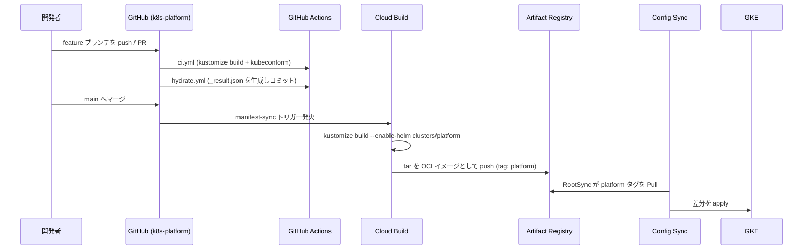
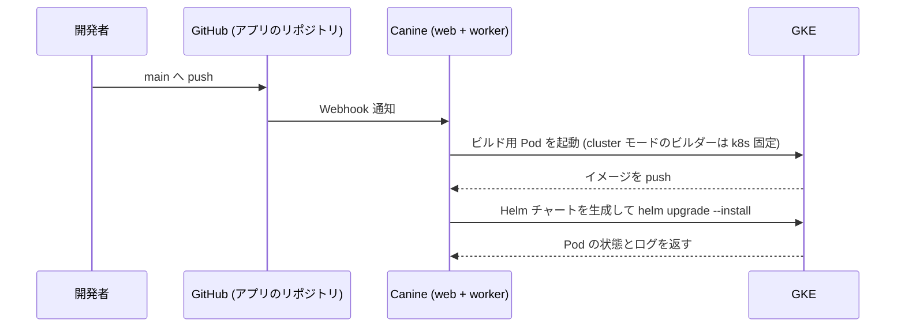

# デプロイメント＆リリースフロー

本プラットフォームには**2つの独立したデプロイ経路**があります。どちらを使うかは「何を変更するか」で決まります。

| 変更対象 | 経路 | 所要時間の目安 |
| :--- | :--- | :--- |
| プラットフォーム基盤（アドオン / ミドルウェア / Canine 自身） | Git → Cloud Build → Artifact Registry (OCI) → Config Sync | 数分 |
| アプリケーション | アプリの Git リポジトリ → Canine（ビルド → デプロイ） | 数分 |

## 1. プラットフォーム変更のフロー



### 1.1 ローカルでの事前検証

```powershell
cargo make validate    # kustomize build + kubeconform
cargo make hydrate     # _result.json を再生成
cargo make pre-commit  # 上記2つをまとめて実行
```

`_result.json` は「Config Sync が最終的にクラスタへ送る API オブジェクト」のスナップショットです。PR の差分として現れるため、Helm チャートのバージョンを上げたときに**実際に何が変わるのか**をレビューできます。

### 1.2 CI で走るもの

| ワークフロー | 内容 |
| :--- | :--- |
| `ci.yml` | 全 `kustomization.yaml` を `kustomize build` し、`kubeconform -strict` でスキーマ検証 |
| `hydrate.yml` | `_result.json` を再生成し、差分があれば PR ブランチへコミット |
| `format-and-lint.yml` | Prettier と Super-Linter による整形・構文チェック |
| `secret-scanning.yml` | TruffleHog / gitleaks による機密情報スキャン |

### 1.3 Config Sync の適用

`clusters/platform/root-sync.yaml` が OCI イメージの `platform` タグを監視します。Cloud Build が新しいタグを push すると、RootSync が自動的に差分を取り込みます。

デプロイ順序は `config.kubernetes.io/depends-on` アノテーションで制御しています。

1. **Kyverno**（`addons/kyverno`）— 後続 Pod のイメージ書き換えを確実に行うため最優先
2. **External Secrets**（`addons/external-secrets`）— Kyverno の Admission Controller に依存
3. **Canine**（`components/infrastructure/canine`）— External Secrets が Secret を作ってから起動

### 1.4 ロールバック

Config Sync は Git（正確には OCI タグ）の状態に追従します。`git revert` して main に戻せば、Cloud Build が再ビルドし、クラスタも元に戻ります。緊急時は Artifact Registry 上の以前の `platform-<COMMIT_SHA>` タグを `platform` に付け替えることで、Git を待たずに巻き戻せます。

## 2. アプリケーションのフロー (Canine)

アプリの定義は本リポジトリには存在しません。Canine の UI（または API）で管理します。



### 2.1 ビルドの仕組み

`BOOT_MODE=cluster` では、Canine のビルダーは `k8s` に固定されます（`BuildConfiguration::BUILDER_OPTIONS`）。Docker ソケットのマウントは不要で、ビルドはクラスタ内の Pod として実行されます。

### 2.2 公開

Canine がアプリ用に Ingress を作る構成にしていないため、外部公開は Cloudflare Tunnel 側で行います。Cloudflare ダッシュボードで Public hostname を追加し、Canine が作成した Service（`http://<service>.<namespace>.svc.cluster.local:<port>`）に向けてください。

### 2.3 ロールバック

Canine の UI からリビジョンを選んでロールバックします。内部的には Helm のリリース履歴に相当します。**Git ではロールバックできません**。

## 3. 2つの経路が交差する箇所

| 事象 | 影響 |
| :--- | :--- |
| Kyverno のレジストリ書き換えポリシー | Canine がデプロイするアプリの Pod にも適用される。プライベートレジストリを使う場合は除外設定が必要 |
| `apps-pool` の上限 | `apps_pool_max_nodes` を超えるとアプリが Pending になる。Canine 側からは「起動しない」ように見える |
| Canine 本体の停止 | 稼働中のアプリは動き続ける（Canine はコントロールプレーンのみ）。新規デプロイとログ参照ができなくなる |
| `canine-db` の喪失 | **アプリの定義が失われる**。稼働中の Pod は残るが、Canine から管理できなくなる |

## 4. 認証情報

- **Cloud Build → Artifact Registry**: `cloudbuild_sa` サービスアカウント（Terraform 管理）
- **Config Sync → Artifact Registry**: `config-sync-sa` + Workload Identity。リポジトリ認証情報をクラスタに置かない
- **Canine → Cloud SQL**: `canine-sa` (KSA) → `canine-sa@<project>.iam.gserviceaccount.com` (GSA) の Workload Identity バインディング
- **Canine → GKE API**: ServiceAccount トークンから組み立てる in-cluster kubeconfig
- **Canine → GitHub**: Canine の UI から GitHub App / OAuth を接続（Canine のデータベースに保存）
